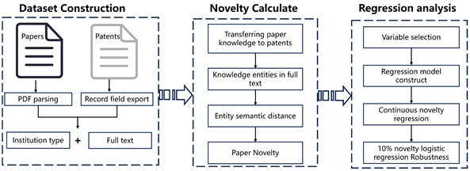
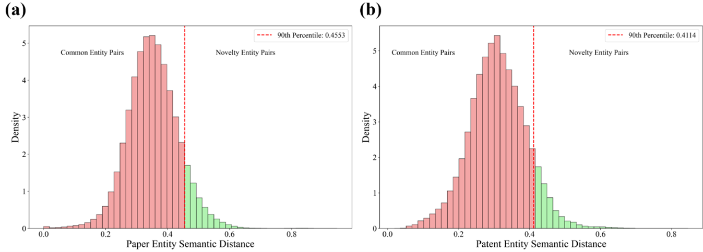
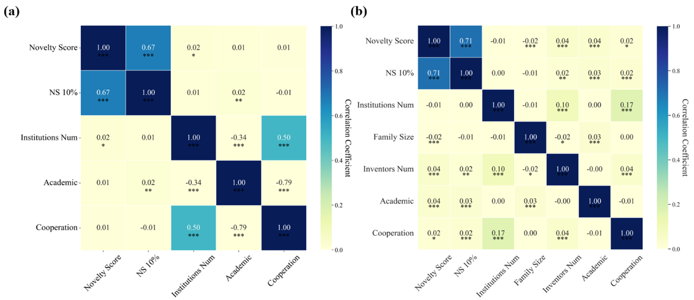
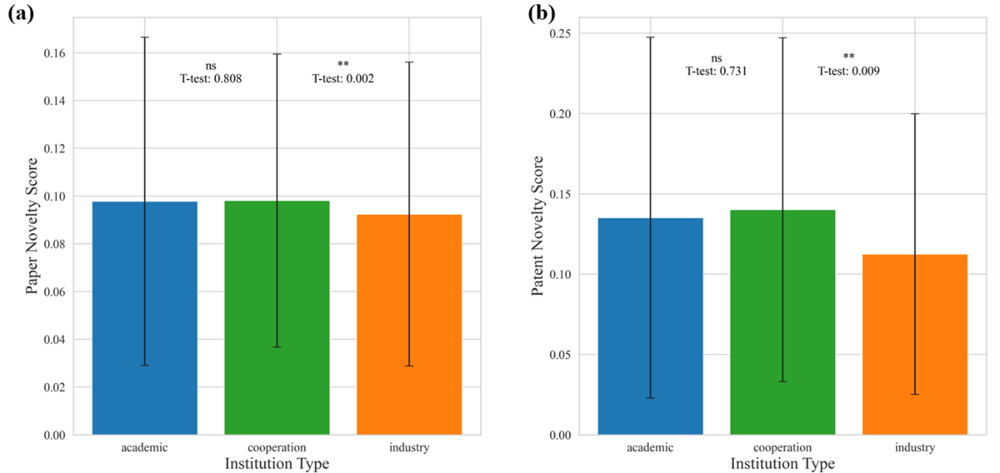

# **Where are Novel Ideas Generated: Academia or Industry? Evidence from Natural Language Processing Domain**

## Overview

**Dataset and source code for paper "Where are Novel Ideas Generated: Academia or Industry? Evidence from Natural Language Processing Domain".**

* **Objective**: This project investigates the comparative novelty of academic and industrial outputs in the field of Natural Language Processing (NLP).

* **Research Question**: The study addresses the debate on whether academia or industry produces more novel ideas, particularly in the context of NLP.

* **Data Sources**: The analysis uses both academic papers and patents to measure and compare the novelty of outputs from academia and industry.

* **Novelty Measurement**: A fine-grained, knowledge entity-based novelty measurement approach is applied to quantify the innovation of publications.

## Main findings
  - Academia demonstrates higher novelty in both patents and papers.
  - Academic involvement significantly enhances the novelty of patents.

## Related work

<b>Figure 1. Related works of novelty measurement</b>

## Method

   - **Dataset construction.** We constructed an original dataset that includes scientific and technical literature in the NLP field, comprising papers and patents published between 2000 and 2022, and extracted author information and their affiliated institutions for each document. [The data for the paper refer to the work of the Zhang et al. (2024)]([ZH-heng/technology_development](https://github.com/ZH-heng/technology_development))
   - **novelty Calculate.** Fine-grained knowledge entities were extracted from both academic papers and patents, with the knowledge from academic papers being transferred to patents. The difficulty of their combinations was measured based on the semantic distances between these entities. This approach was then used to assess the novelty of each document. 
   - **Regression analysis.** A regression model was employed to conduct statistical tests on the novelty of scientific and technical literature from different institutions. Additionally, we treated the top 10% of papers and patents each year as high-novelty documents and performed a robustness check of our results using binary logistic regression.

<b>Figure 2. Framework of this study</b>

## Results

<b>Figure 3. Semantic distance distribution of fine-grained knowledge entities (a) Semantic distance distribution of paper entities; (b) Semantic distance distribution of patent entities.</b>

We found a strong correlation between the continuous and discrete forms of the dependent variable (novelty), while the correlations between the independent and dependent variables were weak. We then calculated the variance inflation factors (VIFs) for all explanatory variables to assess multicollinearity. The VIF for papers was 2.79 and for patents was 1.07, both below the threshold of 5. These results indicate that multicollinearity has minimal impact on our model, ensuring the reliability of the estimates

<b>Figure 4. Pearson's rank correlation coefficient matrix (a) Correlation between variables in papers (b) Correlation between variables in patents</b>

At both the paper and patent levels, academic and collaborative institutions exhibited higher novelty than industrial ones. Further, using t-tests, we found that the novelty differences between academic and collaborative institutions were not significant, with both exhibiting higher novelty than the industrial sector. To more accurately characterize the results and their reliability, we conducted regression analysis, controlling for year and institution count, to evaluate the novelty of different types of literature.

<b>Figure 5. Box plot of novelty distribution. (a) Novelty differences across publishing institutions in the papers (b) Novelty differences across publishing institutions in the patents</b>

## Directory structure

<pre>
entity_novelty
├─ README.md
├─ code
│    ├─ entity_semantic_function.py
│    ├─ paper_novelty_stata.ipynb
│    └─ patent_novelty_stata.ipynb
├─ data
│    ├─ paper_demo
│    │    ├─ ACL_authors.xlsx
│    │    ├─ paper-ent-ids.parquet
│    │    └─ paper_title_abstract.xlsx
│    └─ patent_demo
│           └─ 4001-5000.XLSX
└─ image
       ├─ Box.png
       ├─ authors.png
       ├─ entity_semantic.png
       ├─ framework.png
       ├─ matrix.png
       └─ related_work.png
</pre>

## Dependency packages
System environment is set up according to the following configuration:
- pytorch 2.0.1
- transformers 4.28.1
- pandas 2.0.0
- tqdm 4.65.0
- nltk 3.8.1
- numpy 1.24.1

## Citation
Please cite the following paper if you use this code and dataset in your work.
    
